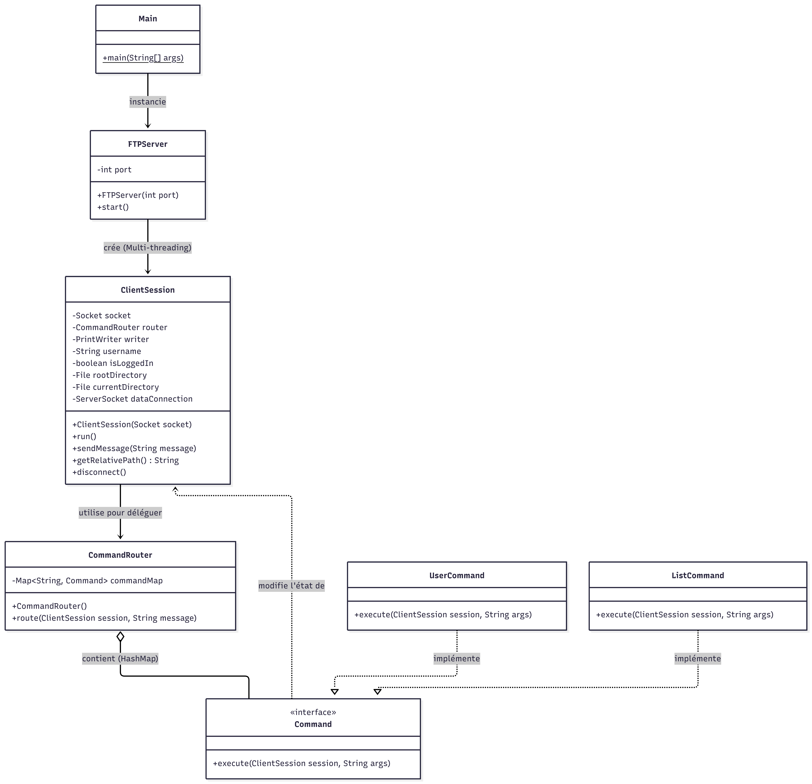
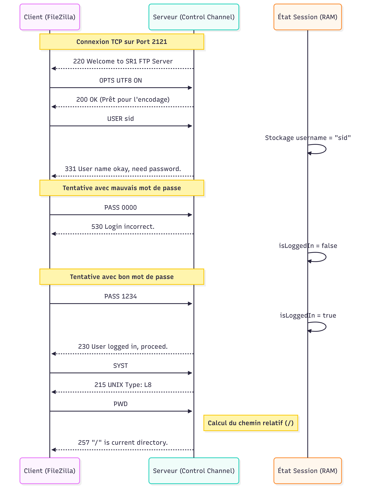
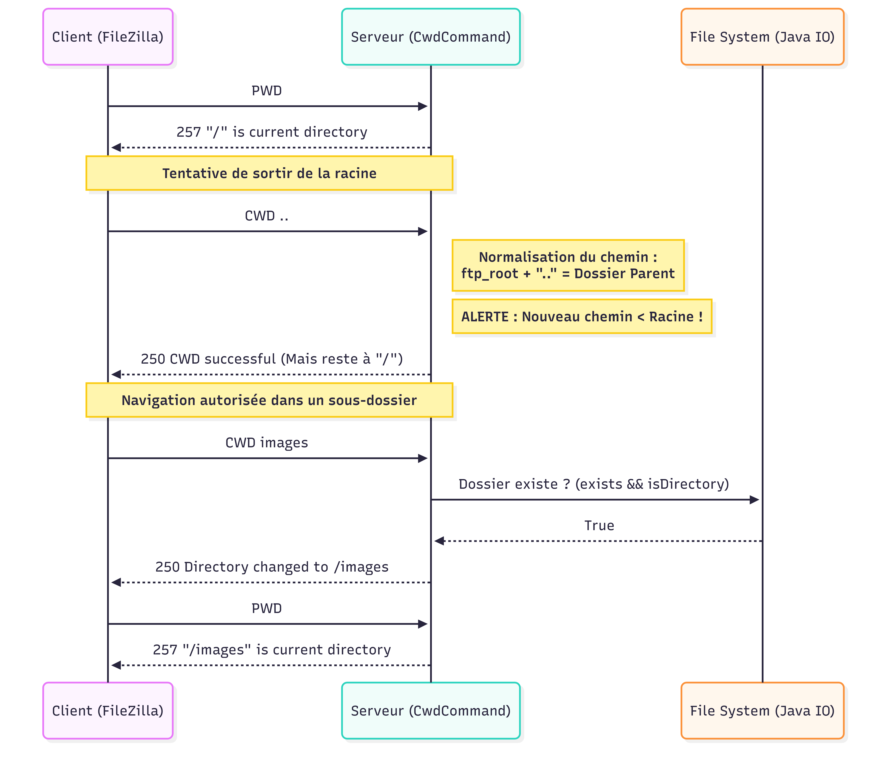
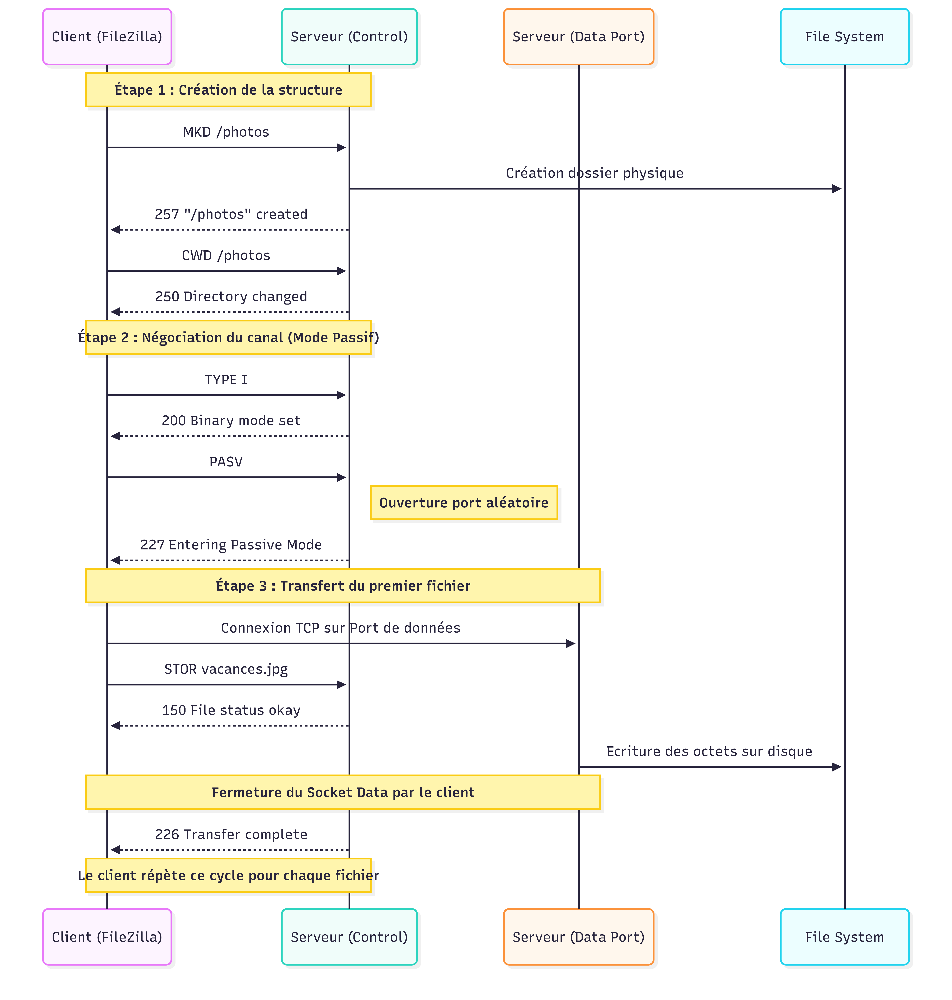

# Introduction

Ce projet consiste en l'implémentation d'un serveur FTP fonctionnel en
Java. Il a été réalisé dans le cadre de L'UE **Systèmes Répartis 1**,
et correspond au **Projet 2**.

Le serveur prend en charge les connexions de plusieurs clients
simultanément via des Sockets, gère la navigation sécurisée dans un
système de fichiers virtuel (Chroot Jail restreint au répertoire
`ftp_root`), et traite les requêtes FTP standard à travers un routeur de
commandes.

**Auteur :** Sid Ahmed Ferroudj

------------------------------------------------------------------------

# Instruction build et execution


Pour les étapes suivantes, ouvrez un terminal et placez-vous à la racine
de projet. Assurez-vous d'avoir le JDK (Java Development Kit)
installé.


### 1. Comment compiler et exécuter le code : Normal

Cette méthode compile directement le code source et lance le serveur
depuis les fichiers `.class`.

-   **Commande de compilation (Windows / Linux) :**

``` bash
mkdir bin
javac -d bin -sourcepath src src/Main.java
```

-   **Commande d'exécution :**

    -   **Windows :** `java -cp bin Main`
    -   **Linux / Mac :** `java -cp bin Main`

### 2. Comment compiler et exécuter le code : JAR

Cette méthode emboîte tout le code compilé dans un seul fichier
exécutable `.jar`, ce qui rend le logiciel portable sur n'importe quel
ordinateur disposant de Java.

-   **Créer le fichier JAR (Windows / Linux) :** (Assurez-vous d'avoir
    compilé le code avec l'étape 3 d'abord)

``` bash
jar cfe ServeurFTP.jar Main -C bin .
```

*Explication : `c` crée l'archive, `f` la nomme `ServeurFTP.jar`, et `e`
définit `Main` comme point d'entrée.*

-   **Exécuter le fichier JAR (Windows / Linux) :**

``` bash
java -jar ServeurFTP.jar
```

> **Note d'exécution :** Au lancement, le programme affichera
> `Starting FTP Server on port 2121` et créera automatiquement un
> dossier `ftp_root` dans le répertoire où vous avez exécuté la
> commande.


### 3. Comment compiler et exécuter : Tests

Puisque ce projet n'utilise pas d'outil comme Maven, la compilation et
l'exécution des tests en ligne de commande nécessitent la librairie
autonome de JUnit (`junit-platform-console-standalone.jar`). Placez ce
fichier `.jar` dans un dossier `lib/` à la racine de votre projet.

-   **Compiler les tests :** Il faut lier le code source compilé (`bin`)
    et la librairie JUnit.

    -   **Windows :** (Utilise `;` comme séparateur)

    ``` cmd
    mkdir bin_test
    javac -d bin_test -cp "bin;lib/*" test/server/*.java test/commands/*.java
    ```

    -   **Linux / Mac :** (Utilise `:` comme séparateur)

    ``` bash
    mkdir bin_test
    javac -d bin_test -cp "bin:lib/*" test/server/*.java test/commands/*.java
    ```

-   **Exécuter les tests :**

    -   **Windows :**

    ``` cmd
    java -jar lib/junit-platform-console-standalone-1.14.3.jar -cp "bin;bin_test" --scan-classpath
    ```

    -   **Linux / Mac :**

    ``` bash
    java -jar lib/junit-platform-console-standalone-1.14.3.jar -cp "bin:bin_test" --scan-classpath
    ```

### 4. Comment générer la JavaDoc

La commande suivante lit le code source et génère la documentation HTML.

-   **Commande (Windows / Linux) :**

``` bash
mkdir docs
javadoc -d docs -sourcepath src src/Main.java src/server/*.java src/commands/*.java
```

-   **Où la trouver ?** Une fois la commande exécutée, ouvrez le fichier
    `index.html` qui vient d'être créé à l'intérieur du dossier `docs/`
    avec n'importe quel navigateur web (Chrome, Firefox, etc.).

------------------------------------------------------------------------

# Notes sur l'Authentification et le Port

Pour simplifier les tests, l'authentification est actuellement codée en
dur (hard-coded) dans le système. Voici les identifiants à utiliser dans
FileZilla ou tout autre client FTP :
 ------------------ -------------------
**Adresse**    `localhost`
**Utilisateur**    `user`
**Mot de passe**   `sr1`
**Port**           `2121`

### ⚙Comment modifier ces paramètres ?

Si vous souhaitez changer ces valeurs, vous devez modifier les classes
suivantes dans le code source avant de recompiler :

1.  **Le Port :**\
    Ouvrez `src/Main.java`. Modifiez la variable `int port = 2121;` à la
    ligne correspondante.

2.  **L'Utilisateur :**\
    Ouvrez `src/commands/UserCommand.java`. Le serveur accepte
    actuellement n'importe quel nom d'utilisateur et le stocke dans la
    session. Pour restreindre à un nom précis, il suffit d'ajouter une
    condition `if` dans la méthode `execute`.

3.  **Le Mot de passe :**\
    Ouvrez `src/commands/PassCommand.java`. La vérification se fait via
    une comparaison de chaîne de caractères :\
    `if ("1234".equals(args))`. Modifiez `"1234"` par le mot de passe de
    votre choix.

> **Note de sécurité :** Ce mécanisme est destiné à un usage
> pédagogique. Dans une version de production, ces informations seraient
> stockées de manière sécurisée (hachées) dans un fichier de
> configuration ou une base de données.

------------------------------------------------------------------------

# Architecture du Système

## Découpage et Types de Classes

Le code du projet est découpé en plusieurs parties simples pour bien séparer les rôles. Il y a quatre grands groupes de classes :

1. **Le Démarrage (Main & FTPServer) :** Ces classes lancent le serveur et écoutent le réseau pour accepter les nouveaux clients.
2. **La Session Client (ClientSession) :** C'est le centre de contrôle pour chaque client. Cette classe retient les informations de l'utilisateur (s'il est connecté, dans quel dossier il se trouve) et le bloque dans sa "prison" virtuelle (Chroot Jail).
3. **Le Routeur (CommandRouter) :** Il lit le texte envoyé par le client (ex: "USER sid") et déclenche la bonne commande.
4. **Les Commandes (Package `commands`) :** Chaque action FTP est codée dans sa propre classe, indépendante des autres. Toutes ces classes utilisent l'interface `Command`.


##  Modularité des Commandes

L'un des points forts de cette architecture est l'application du
**Design Pattern Command**.

-   **Extensibilité :** Chaque commande FTP (USER, LIST, STOR, etc.) est
    encapsulée dans sa propre classe. Pour ajouter une nouvelle
    fonctionnalité, il suffit de créer une nouvelle classe sans modifier
    le reste du serveur.
-   **Séquence de commandes :** Pour répondre au cahier des charges
    (authentification -\> navigation -\> transfert), le serveur traite
    les commandes une par une, en vérifiant l'état de la session à
    chaque étape.

#  Méthodes de Test et de Validation

Le cahier des charges demande des résultats précis (liste de fichiers,
transferts réussis, etc.). Sous le capot, la logique reste identique
quelle que soit la méthode utilisée pour interagir avec le serveur :

1.  **Client FTP Graphique (ex: FileZilla) :** C'est la méthode
    recommandée pour valider visuellement le projet. FileZilla envoie
    des séquences de commandes complexes de manière automatisée.
2.  **Client FTP en ligne de commande :** Permet une validation "brute"
    commande par commande, bien que cela soit plus fastidieux pour les
    transferts de données binaires.

Dans les deux cas, le serveur traite les protocoles de la même manière,
garantissant une conformité totale aux standards FTP.

# Flux de Séquences du Programme

Cette section détaille le dialogue entre le client (ex: FileZilla) et
notre serveur. Le protocole FTP est un protocole d'état : l'ordre des
commandes est crucial pour le succès des opérations.

Nous avons identifié trois séquences critiques qui illustrent le  fonctionnement interne du serveur :

## Séquence d'Authentification et Affichage du Répertoire Courant

Le protocole FTP commence par un "Handshake" où le serveur attend
l'identité de l'utilisateur avant d'autoriser toute action. Si le mot de
passe est incorrect, le serveur rejette l'accès et maintient le client
dans un état non-authentifié ; en cas de succès, le client accède à sa
racine et peut solliciter le canal de données pour lister les fichiers.

Lorsqu'un client comme FileZilla se connecte, il ne se contente pas
d'envoyer les identifiants ; il tente par contre de stabiliser
l'environnement via des commandes comme OPTS UTF8 ON (pour l'encodage)
et SYST (pour connaître l'OS du serveur). Le serveur gère cette phase en
mode "Automate à États" : il mémorise le nom d'utilisateur après la
commande USER mais refuse toute action (comme LIST ou CWD) tant que le
PASS n'a pas été validé, renvoyant systématiquement un code 530. Une
fois authentifié, FileZilla force systématiquement une commande PWD pour
synchroniser l'affichage de l'interface graphique avec le répertoire
réel du serveur.



--

## Sécurité du Système de Fichiers (Chroot Jail & Navigation)

Le serveur implémente une sécurité de type "Chroot Jail" au sein de la
classe ClientSession. Lorsqu'un utilisateur envoie une commande de
navigation comme CWD .. (Change Working Directory) ou CDUP (Change to
Parent Directory), le serveur ne se contente pas de déléguer l'opération
au système d'exploitation. Il recalcule le chemin absolu résultant et le
compare au chemin de la racine ftp_root. Si le chemin calculé se situe
"en dehors" ou "au-dessus" de la racine, la commande est interceptée, le
dossier courant reste inchangé, et un code d'erreur 550 est renvoyé pour maintenir l'utilisateur dans son
périmètre autorisé.




## Transferts Récursifs et Gestion du Canal de Données

Le transfert récursif d'un dossier (Upload ou Download) repose sur une
orchestration côté client, car le protocole FTP ne traite que
des fichiers individuels. Pour chaque dossier rencontré, le client doit
d'abord recréer l'arborescence via MKD et naviguer avec CWD. Pour chaque
fichier, une nouvelle connexion de données est négociée via la commande
PASV. Le serveur ouvre alors un ServerSocket éphémère et attend que le
client s'y connecte. Ce n'est qu'une fois ce canal de données établi que
la commande STOR (pour l'upload) ou RETR (pour le download) est lancée,
déclenchant le transfert binaire des octets avant de refermer la
connexion de données pour signaler la fin du fichier.


